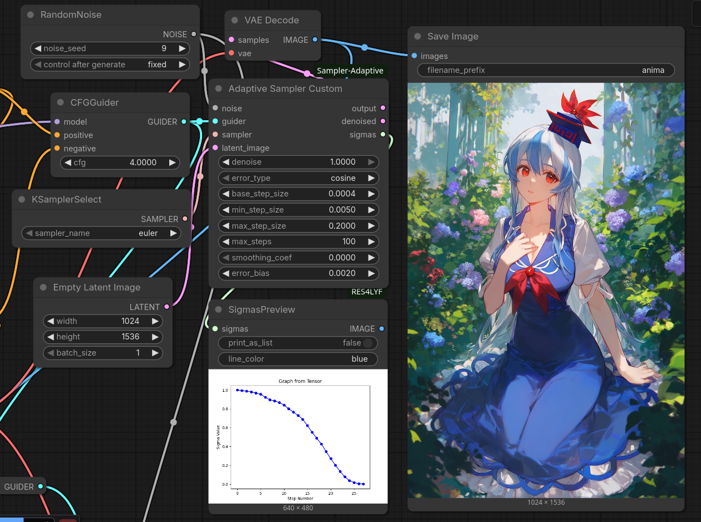

# ComfyUI-Sampler-Adaptive

Adaptive sampling custom node for ComfyUI.

See `workflow_example.json` for an example workflow.

## Known Limitations

- Ancestral samplers (e.g., `euler_ancestral`, `dpmpp_2s_ancestral`) do not work correctly at this time.
- Samplers from RES4LYF are not supported.

## Parameters

- **error_type**: Cosine or MSE similarity for error calculation between steps
- **base_step_size**: Base multiplier for step size adaptation
- **min_step_size**: Minimum allowed step size
- **max_step_size**: Maximum allowed step size
- **max_steps**: Maximum number of adaptive steps
- **smoothing_coef**: Smoothing coefficient for step size updates (0.0 = no smoothing, 1.0 = full smoothing)
